# AIS AI Development Template with Copilot

An Azure Integration Services development template that leverages AI agents and GitHub Copilot to automate the creation of comprehensive integration patterns, specifications, and implementations.

## Overview

This template implements an autonomous agent flow for Azure Integration Services development, utilizing specialized AI agents to streamline the entire development lifecycle from discovery to documentation.

## Agent Flow

The development workflow follows a structured approach using specialized agents:

```mermaid
flowchart TD
    A[🕵️ Discovery Analyst<br/>Generates IDD] --> B[📋 Solution Architect<br/>Creates IRD]
    B --> C[🔧 Agent<br/>Creates dev-plan, creating and assigning issues to GitHub Coding Agent]
    B --> D[🔧 Integration Developer<br/>Develops code using AZD templates and Bicep]
    D --> E[🔍 Test Engineer<br/>Creates tests, executes & reports the results]
    E --> F[📚 Documentation Specialist<br/>Generates Final Docs]
```



### Agents

1. **Discovery Analyst** - Performs automated discovery of Azure Integration Landing Zones and generates Integration Discovery Documents (IDD)
2. **Solution Architect** - Creates Integration Requirement Documents (IRD) based on business needs and technical requirements
3. **Implementation Agent** - Develops integration code using AZD templates and Bicep, manages GitHub issues
4. **Test Engineer** - Creates and executes tests based on requirements and implementation
5. **Documentation Specialist** - Generates comprehensive documentation for the integration solution

## Agent Prompt Files

The template includes specialized prompt files in `.github/prompts/` that enable GitHub Copilot to act as different AI agents throughout the development workflow. Each prompt file is designed to focus Copilot on specific tasks and responsibilities.

### Available Prompt Files

| File | Agent Role | Purpose |
|------|------------|---------|
| `0-chatmodes-model-router.prompt.md` | **Model Router** | Determines the optimal AI model for each development task |
| `1-discovery-analyst.prompt.md` | **Discovery Analyst** | Scans Azure subscription to discover integration services and generate IDD |
| `2-solution-architect.prompt.md` | **Solution Architect** | Creates Integration Requirement Documents based on business needs |
| `3-1-agent.prompt.md` | **Implementation Agent** | Manages development planning and GitHub issue creation |
| `3-2-0-integration-developer.prompt.md` | **Integration Developer** | Develops code using AZD templates and Bicep |
| `3-2-1-test-engineer.prompt.md` | **Test Engineer** | Creates and executes comprehensive tests |
| `3-2-2-documentation-specialist.md` | **Documentation Specialist** | Generates final documentation and guides |

### How to Use Agent Prompts

#### Prerequisites: Model Router Setup

**⚠️ Important**: Always start with the Model Router prompt before using other agents.

1. **First, run the Model Router** to determine optimal models:
   ```
   @.github/prompts/0-chatmodes-model-router.prompt.md
   ```
   
   This analyzes your tasks and assigns the most suitable AI model for each agent role based on GitHub's recommended models by task. This ensures optimal performance and accuracy for each development phase.

#### Agent Workflow Usage

2. **Discovery Phase**:
   ```
   @.github/prompts/1-discovery-analyst.prompt.md
   ```
   
3. **Architecture Phase**:
   ```
   @.github/prompts/2-solution-architect.prompt.md
   ```

4. **Implementation Phase**:
   ```
   @.github/prompts/3-1-agent.prompt.md
   @.github/prompts/3-2-0-integration-developer.prompt.md
   ```

5. **Testing Phase**:
   ```
   @.github/prompts/3-2-1-test-engineer.prompt.md
   ```

6. **Documentation Phase**:
   ```
   @.github/prompts/3-2-2-documentation-specialist.md
   ```

### Best Practices

- **Sequential Execution**: Follow the numbered sequence for optimal results
- **Context Preservation**: Each agent builds upon the work of previous agents
- **Model Optimization**: The Model Router ensures each agent uses the most appropriate AI model
- **Azure Integration**: All prompts are designed to work with Azure Integration Services and the AZD template structure
- **Autonomous Operation**: Each agent is designed to work independently while maintaining workflow continuity

### Chat Modes Integration

The prompts work in conjunction with the chat modes defined in `.github/chatmodes/` to provide context-aware assistance throughout the development lifecycle.

## Technical Stack

- **Reference Landing Zone**: [azd-ais-lza](https://github.com/pascalvanderheiden/azd-ais-lza)
- **Structure**: Azure Developer CLI (`azd`) templates
- **Event Model**: CloudEvents v1.0+ specification
- **Core Services**: API Management, Logic Apps, Azure Functions, Service Bus, Event Grid
- **Infrastructure**: Bicep modules with managed identity and private endpoints
- **CI/CD**: GitHub Actions aligned with AZD templates

## Project Structure

```
├── docs/                    # Documentation and agent flow specifications
├── infra/                   # Bicep infrastructure templates
├── specs/                   # Generated specifications and plans
│   ├── diagrams/            # Integration architecture diagrams
│   ├── docs/               # IDD and IRD documents
│   ├── plans/              # Development plans and summaries
│   └── raw/                # Raw specification data
├── src/                    # Application code
├── tests/                  # Test code, configuration, and reports
│   ├── code/               # Executable test files
│   ├── config/             # Test configuration
│   └── reports/            # Test execution results
└── .github/                # GitHub workflows and Copilot instructions
```

## Model Context Protocol (MCP) Configuration

The template includes a comprehensive MCP configuration (`.vscode/mcp.json`) that enables AI agents to interact with various external services and APIs. This configuration is essential for the autonomous agent workflow:

### Configured MCP Servers

- **Context7** (`https://mcp.context7.com/mcp`) - Provides access to library documentation and code examples
- **GitHub** (`https://api.githubcopilot.com/mcp`) - Enables GitHub integration for issue management, PR creation, and repository operations
- **Microsoft Docs** (`https://learn.microsoft.com/api/mcp`) - Access to official Microsoft and Azure documentation
- **Playwright** (`@playwright/mcp@latest`) - Web automation and testing capabilities
- **Azure** (`@azure/mcp@latest`) - Azure resource management and deployment operations

### Purpose in Agent Workflow

The MCP configuration enables each agent to:
- **Discovery Analyst**: Connect to Azure services to discover existing resources
- **Solution Architect**: Access documentation and best practices for requirements gathering
- **Implementation Agent**: Interact with GitHub for issue creation and project management
- **Test Engineer**: Use Playwright for end-to-end testing scenarios
- **Documentation Specialist**: Access comprehensive documentation sources

This setup ensures that AI agents have the necessary tools and context to perform their specialized tasks effectively within the Azure Integration Services development lifecycle.

## Key Features

- **Event-Driven Architecture** using CloudEvents specification
- **Modular Design** with loose coupling and idempotency
- **Security First** approach with managed identities and Key Vault integration
- **Infrastructure as Code** using Bicep modules
- **Automated Testing** with comprehensive test frameworks
- **AI-Powered Development** workflow with GitHub Copilot integration

## Getting Started

1. **Prerequisites**
   - Azure CLI
   - Azure Developer CLI (azd)
   - PowerShell
   - GitHub account with Copilot access

2. **Initialize Project**
   ```powershell
   azd init --template https://github.com/pascalvanderheiden/ais-ai-dev-template-copilot
   ```

3. **Configure Environment**
   - Set up Azure subscription and resource group
   - Configure GitHub repository settings
   - Enable Copilot for the repository

4. **Start Development**
   - Begin with Discovery Analyst agent to generate IDD
   - Use Solution Architect agent to create IRD
   - Let the Implementation Agent create development plans and GitHub issues
   - Execute tests with Test Engineer agent
   - Generate final documentation with Documentation Specialist

## Security Model

- Managed identities for service-to-service communication
- Private endpoints for secure connectivity
- Key Vault for secrets management
- API Management for external authentication and rate limiting
- Role-based access control throughout the solution

## Contributing

- All changes must go through pull requests
- Minimum one review required before merging
- Address all review comments
- Keep PRs focused and small
- Follow Azure Well-Architected Framework principles

## License

This project is licensed under the MIT License - see the LICENSE file for details.

## Related Resources

- [Azure Integration Services Landing Zone](https://github.com/pascalvanderheiden/azd-ais-lza)
- [Azure Developer CLI Documentation](https://learn.microsoft.com/en-us/azure/developer/azure-developer-cli/)
- [CloudEvents Specification](https://github.com/cloudevents/spec)
- [Azure Well-Architected Framework](https://docs.microsoft.com/en-us/azure/architecture/framework/)
