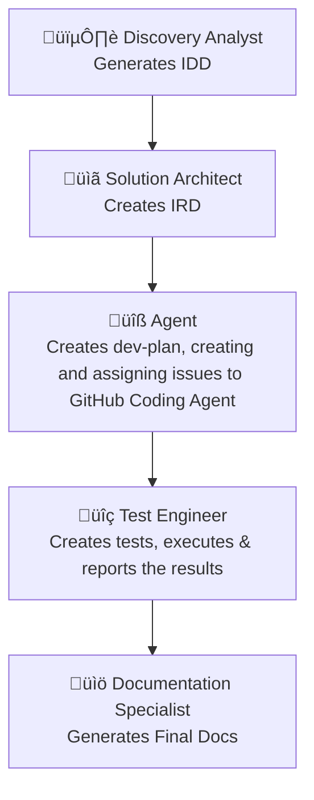
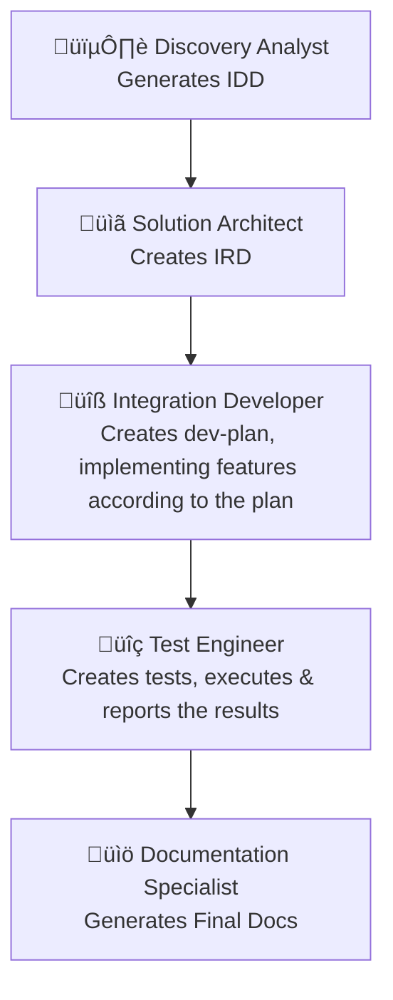

# Integration Development Team Flow

## Autonomous Agent Flow

Azure Integration Services development workflow using specialized agents to create comprehensive integration patterns, specifications, and implementations.



### Discovery Analyst Agent

**Role:** Performs automated discovery of Azure Integration Landing Zones and generates the Integration Discovery Document (IDD).

**Responsibilities:**
- Connect to Azure MCP Server using provided subscription and tag filters.
- Discover deployed Azure Integration Services, AppGW, Frontdoor, App Insights, Log Analytics, Azure Monitor, Key Vault, ASEv3, and App Service Plans.
- Included detailed information about the Network Topology, including VNETs, subnets, and private endpoints.
- Generate architecture diagrams using Mermaid and embed that into the IDD.
- Produce a static document summarizing the findings.

**Output:**
- `/specs/docs/IDD.md`: Integration Discovery Document in Markdown format including architecture diagrams and discovered resources.

**Example Prompt:**
```
Please scan my Azure subscription and discover all deployed integration services. 
Focus on resources tagged with "azd-env-name:azd-ais-lza-dev". 
Generate the IDD for the discovered architecture.
```

### Solution Architect Agent

**Role:** Crafts and maintains the Integration Requirement Document (IRD), translating business needs into technical requirements, including data mapping and transformation rules

**Responsibilities:**
- Translate business needs into functional and non-functional requirements.
- Identify systems, data formats, and integration objectives.
- Ensure the IRD remains a living document throughout the project.
- Analyze IDD to define integration architecture.
- Select appropriate design patterns and protocols.
- Include security architecture and compliance considerations.
- Include field mappings between source and target systems.
- Generate Mermaid diagrams to explain the integration flows in the IRD.

**Output:**
- `/specs/docs/IRD.md`: Integration Requirement Document in Markdown format.

**Example Prompt:**
```
Draft an IRD for the integration between our webshop and our Dynamics 365 backend stored in Dataverse. Our webshop can connect via APIs, and we need to be able to exchange order data, customer data and delivery status information. Orders created in the webshop must not be lost when our backend isn't up. The format used is JSON. We also need to be prepared that mappings can change over time, so generate a mapping for now, so this can be updated in the future.
```

### Agent

**Role**
Implements integration code using AZD templates and Bicep, following the IRD and IDD requirements.

**Inputs**
- `/specs/docs/IRD.md`: Integration Requirements Document
- `/specs/docs/IDD.md`: Integration Discovery Document

**Instructions**
1. Scaffold First  
   - Create the project structure using the AZD template.  
   - Scan documents in the `/specs` and `/docs` folders, and update the placeholder README.md file.
2. Analyze 
   - Analyse the Integration Development Document (IDD) and Integration Requirements Document (IRD).
   - Create a detailed development plan based on the IRD and IDD.
3. Subtask Breakdown  
   - For each step in the development plan, create a subtask that aligns with the requirements in the IRD and IDD.  
   - Ensure each subtask is small enough to be completed within a single commit.  
   - Reference related IRD requirements and IDD discovery context.
   - Implement integration code using the Azure Developer CLI (AZD) templates using Bicep.
   - Integration specific services are deployed in a separate resource group or are integrated into existing services, like API Management identified in the IDD.
   - Ensure code aligns with IRD and builds successfully.
4. GitHub Issue Creation
   For each subtask, create a GitHub Issue with:
   - **Title**: Short, descriptive
   - **Description**: What needs to be done, where it fits in the scaffolded structure
   - **Dependencies**: Reference predecessor and successor tasks
   - **Labels**: Use labels like `integration`, `test`, `infra`, `mapping`, `retry`, etc.
   - **Assignee**: GitHub Copilot Coding Agent
4. Review & Commit Strategy  
   - Automatically assign each code review to be executed by GitHub Copilot in GitHub.com, when the PR is created based on the related GitHub Issues.
   - Automatically resolve merge conflicts using GitHub Copilot and commit to `main`.
   - Try to completely automate the commit process for all generated code changes.
5. Summary
   - Create a summary of what has been implemented, including any deviations from the plan. Include a list of test scenarios that can be used to verify the implementation.

**Output**
- `/specs/plans/dev-plan.md`: Markdown file listing all subtasks with dependencies
- `/specs/plans/dev-summary.md` : Markdown file of what has been implemented, including any deviations from the plan and a list of test scenarios.
- azd scaffolded project structure:
  - `/src/*`: Integration code organized by service/component
  - `/infra/*`: Bicep or AZD template files
  - `/azure.yaml`: Azure Developer CLI configuration

**Guardrails**
- Do not skip any execution plan steps.
- Avoid creating overlapping or duplicate issues.
- Ensure traceability to IRD and test scenarios.

**Success Criteria**
- All subtasks are clearly defined, testable, and traceable.
- GitHub issues are consistent, actionable, and dependency-aware.
- The development plan aligns with the architecture and requirements.

**Example Prompt:**
```
Implement integration code using AZD templates + Bicep from /specs/docs/IRD.md & /specs/docs/IDD.md by scaffolding the project, creating a detailed dev plan (/specs/plans/dev-plan.md), breaking into traceable subtasks with GitHub Issues (assigned to GitHub Copilot Coding Agent), automating commits/reviews, and producing a final summary (/specs/plans/dev-summary.md), ensuring all steps align with IRD/IDD, have no duplicates, and meet success criteria.
```

## Controlled Agent Flow

Instead of using the GitHub Copilot Coding Agent, you can use the following agents to implement the integration code. These agents are designed to work in a controlled environment, where each agent has a specific role and set of responsibilities.



### Integration Developer Agent

**Role:** Implements integration code using AZD templates and Bicep, following the IRD and IDD requirements.

**Responsibilities:**
- Use AZD templates or fallback to blank Bicep starter templates if no match is found.
- First analyze the Integration Development Document (IDD) and Integration Requirements Document (IRD).
- Create a detailed development plan based on the IRD and IDD.
- Implement integration code using the Azure Developer CLI (AZD) templates and Bicep.
 - Develop based on the detailed development plan and keep track of your progress in this plan.
- Integration specific services are deployed in a separate resource group or are integrated into existing services, like API Management identified in the IDD.
- Ensure code aligns with IRD and builds successfully.
- Create a summary of what has been implemented, including any deviations from the plan. Include a list of test scenarios that can be used to verify the implementation.
- Writes clean, maintainable implementation code following team conventions and modular design.

**Output:**
- `/specs/plans/dev-plan.md`: Markdown file listing all subtasks with dependencies
- azd scaffolded project structure:
  - `/src/*`: Integration code organized by service/component
  - `/infra/*`: Bicep or AZD template files
  - `/azure.yaml`: Azure Developer CLI configuration
- `/specs/plans/dev-summary.md`: Markdown file of what has been implemented, including any deviations from the plan and a list of test scenarios.

**Example Prompt:**
```
Please implement the integration solution using the provided architecture and requirements documents.
Start by analyzing /specs/docs/IDD.md and /specs/docs/IRD.md to extract all integration-related requirements.
Create a detailed development plan in /specs/plans/dev-plan.md listing all subtasks and their dependencies.
First subtask is to scaffold the project using AZD templates, or use a blank Bicep starter if no matching template is found. Implement the integration code in /src/* and infrastructure code in /infra/*, and configure the Azure Developer CLI using /azure.yaml. Ensure all services are deployed in the correct resource group as defined in the IDD. Write a summary in /specs/plans/dev-summary.md describing what was implemented, any deviations from the plan, and a list of test scenarios. Do not write documentation or test cases.
Follow all steps in the development plan without skipping any.
Ensure the output is production-ready, compliant with Azure deployment standards, and traceable to the IRD.
Use any available tools as needed to complete the task.
```

### Test Engineer Agent

**Role:** Converts test cases from the dev-summary into executable test code using standardized frameworks based on integration type and executes them.

**Responsibilities:**
- Select appropriate test framework (e.g., xUnit, MSTest, Postman) based on integration type. And .http file for API testing should always be included.
- Generate test code for each test scenario.
- Ensure tests are maintainable, environment-aware, and aligned with IRD requirements and dev-summary test scenarios.
- Organize tests by feature and scenario.
- Execute the tests one by one using the selected framework, and report the results in test-results.md. Use the `azd` .env file for retrieving environment variables.
- If the test fails, provide a detailed report of the failure, including the error message and stack trace in `test-results.md`.

**Output:**
- `/tests/code/*.test.js|.cs|.http`: Executable test code files
- `/tests/config/test-config.json`: Environment-aware test configuration
- `/tests/reports/test-results.md`: Test execution results

**Example Prompt:**
```
Generate test code for the integration based on the provided dev-summary and IRD. After generated, execute the tests and report the results.
```

### Documentation Specialist Agent

**Role:** Generates final documentation from code, tests, and features in standardized formats for developers and stakeholders.

**Responsibilities:**
- Extract relevant information from code, tests, and Gherkin features
- Generate documentation in Markdown
- Add instructions on how to run the integration patterns locally and how to deploy them via `azd`
- Include sections such as Overview, Setup, Usage, Troubleshooting, and Architecture Diagrams
- Ensure documentation is accessible to both technical and non-technical audiences

**Output:**
- `./README.md`: Main documentation file
- `./CHANGELOG.md`: Optional changelog for version tracking

**Example Prompt:**
```
Generate comprehensive documentation for the webshop-ERP integration. Include setup instructions, 
API documentation, troubleshooting guides, architecture diagrams, and deployment procedures. 
Make it accessible to both developers and business stakeholders.
```
